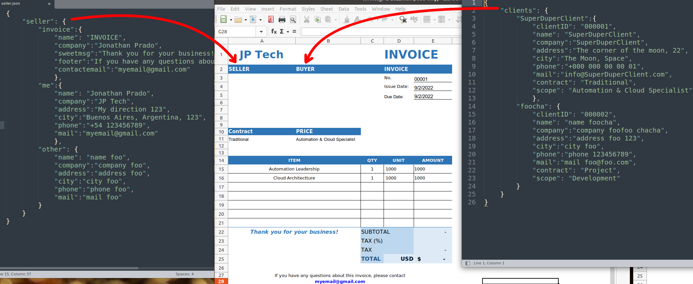

# Python Invoice Generator

### Run without build
    ./invoice-generator.py SELLER CLIENT INVOICE_TYPE
    ./invoice-generator.py me foocha e

### Build 
     docker build -t invoce-generator .     

### Run
    docker run -it -v $PWD:/app invoce-generator me SuperDuperClient

### Logic
    1. Get data from remote json files
    2. Read template.xls 
    3. Parse information and write data
    4. Save new file with format "invoice_DATETIME.xls"     

    <h2>Design</h2>
    

 

     <h2>Example</h2>
    

 

     <h2>Result</h2>
   

    
